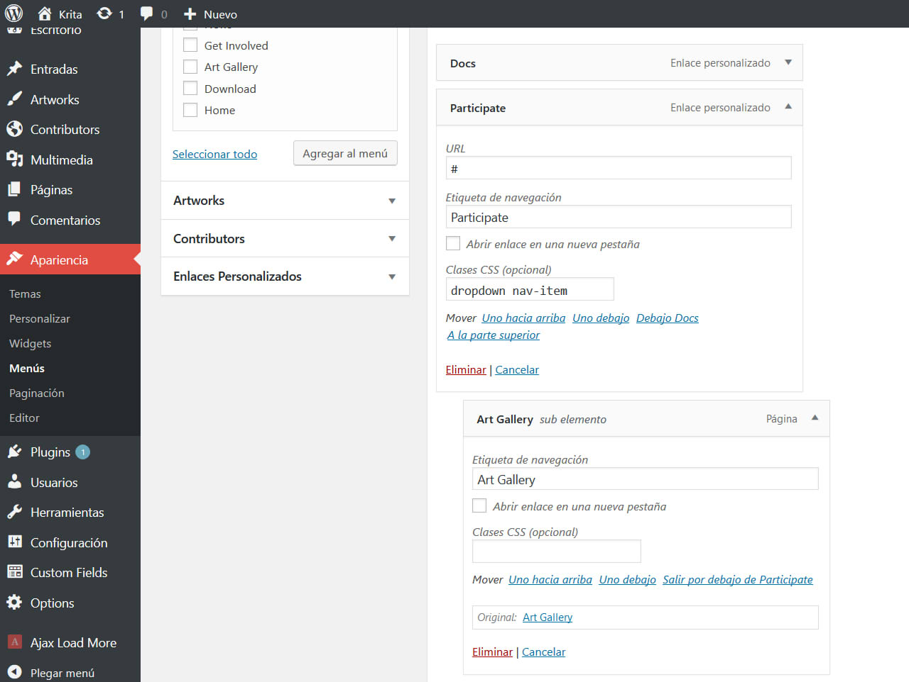
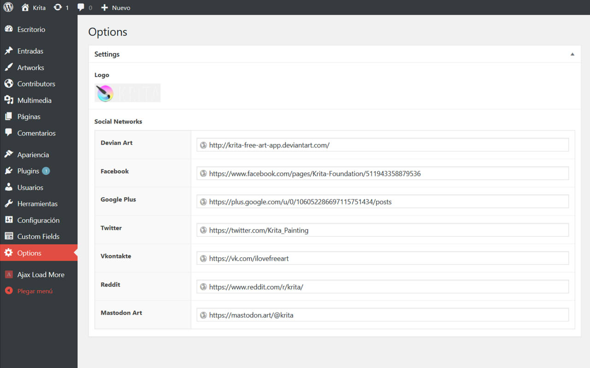

# Proyecto final

## Descripción

Este proyecto consiste en el diseño total de un tema de WordPress. La intención de este tema es mostrar información acerca de un software de dibujo, sus características, actualizaciones, links de descarga, tienda y otros.

Este tema se compone de los siguientes page templates:

- `Art Gallery`: Para mostrar los dibujos de la comunidad con diversos tamaños y de forma responsiva, además viene con la opción de agregar un formulario para que los visitantes de la página puedan compartir sus dibujos.

- `Download`: Para publicar información y links para descargar las distintas versiones del Software.

- `Get Involved`: Para mostrar información con respecto a cómo la gente puede participar del proyecto Krita. Además tiene la opción de incluir un mapa con la ubicación de todos los contribuidores.

Además, existen los siguientes post types:

- `Entradas`: Post por default para subir noticias.
- `Artworks`: Post para subir los dibujos de la comunidad y mostrarlos en la galería de la página con page template Art Gallery.
- `Contributors`: Post para subir la localización de los contribuidores en el mapa de la página con page template Get Involved.

Esta plantilla hace uso de los siguientes JQuery plugins:
- [Waypoints](http://imakewebthings.com/waypoints/guides/jquery-zepto/)
- [jsSocials](http://js-socials.com/start-using/)

#### Nota

Este tema está diseñado como una propuesta al sitio web del software de dibujo [Krita](https://krita.org/en/homepage/).

## Requisitos

Para utilizar correctamente la plantilla es necesario tener instalada la versión 4.9.8 (o superior) de Wordpress y tener instalados los siguientes plugins:
- [ ACF Pro ]( https://www.advancedcustomfields.com/pro/ )( v5.7.0 o superior )
- [ Ajax Load More ]( https://es.wordpress.org/plugins/ajax-load-more/ )( v3.7 o superior )

## Despliegue

- Nombre de usuario: jjjjota
- Contraseña: 8$t7L^E7fQALULSHgh
- Base de datos: proyecto-final.sql

## How to
### Menú Principal

Para crear o editar un menú dirígete a `Apariencia > Menús`, ahí puedes escoger las páginas y URL que quieras para mostrar en la barra de navegación principal.

Para que se muestre correctamente, cada **ítem** del menú debe tener la clase `nav-item`. Si deseas que un ítem tenga **sub-ítems**, al ítem debes asignarle las clases `nav-item` y `dropdown`, <u>a los sub-ítems no les asignes ninguna clase</u>.

### Logo y Redes sociales

En la sección `Options`, puedes añadir una imagen que se utilizará como el logo a lo largo de la página, específicamente en la barra de navegación principal y en el footer.

Además puedes ingresar las URL de tus cuentas a distintas redes sociales, no es necesario que llenes todas. Asegúrate de ingresarlas en las redes correspondientes.

### Advertencia

Esta plantilla aún no tiene un 100% de soporte para las versiones de Internet Explorer, por lo que si no deseas tener problemas con la visualización del contenido en IE no se recomienda usarla.
