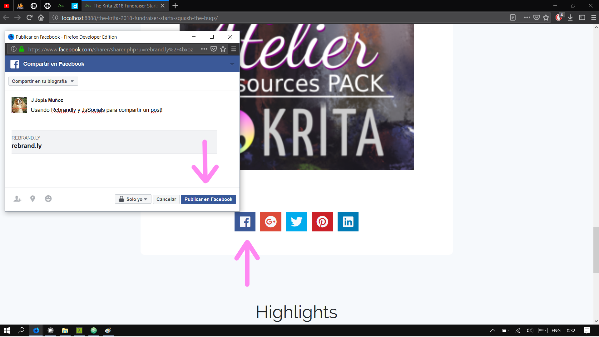

# Proyecto final

- Proyecto en Producción: [Link aquí](http://jopia.digitalpartner.cl)
- Vídeo demostrativo: [Link aquí]()

## Descripción

Este proyecto consiste en el diseño total de un tema de WordPress. La intención de este tema es mostrar información acerca del software de dibujo [Krita](https://krita.org/en/homepage/), sus características, actualizaciones, links de descarga, tienda y otros.

Este tema se compone de los siguientes page templates:

- `Art Gallery`: Para mostrar los dibujos de la comunidad con diversos tamaños y de forma responsiva, además viene con la opción de agregar un formulario para que los visitantes de la página puedan compartir sus dibujos.

- `Download`: Para publicar información y links para descargar las distintas versiones del Software.

- `Get Involved`: Para mostrar información con respecto a cómo la gente puede participar del proyecto Krita. Además tiene la opción de incluir un mapa con la ubicación de todos los contribuidores.

Además, existen los siguientes post types:

- `Entradas`: Post por default para subir noticias.
- `Artworks`: Post para subir los dibujos de la comunidad y mostrarlos en la galería de la página con page template Art Gallery.
- `Contributors`: Post para subir la localización de los contribuidores en el mapa de la página con page template Get Involved.

Este tema se caracteriza por tener casi todos sus módulos opcionales, es decir, dependiendo del page-template seleccionado, encontrarás el botón `Show` a lo largo de los campos customizables, el cual habilitará o deshabilitará la visualización del contenido de la sección en el sitio web. Además, si está desactivado ocultará el resto de campos customizables de la sección.

A continuación se muestra la diferencia entre tener activado y desactivado el botón `Show` en la sección "Join" del front-page:

Esta plantilla hace uso de los siguientes JQuery plugins:
- [Waypoints](http://imakewebthings.com/waypoints/guides/jquery-zepto/)
- [jsSocials](http://js-socials.com/start-using/)

### API Rebrandly

Se hace uso de la API Rebrandly para acortar los links de los posts para compartirlos en redes sociales.

## Requisitos

Para utilizar correctamente la plantilla es necesario tener instalada la versión 4.9.8 (o superior) de Wordpress y tener instalados los siguientes plugins:
- [ACF Pro]( https://www.advancedcustomfields.com/pro/ ) ( v5.7.0 o superior )
- [Ajax Load More]( https://es.wordpress.org/plugins/ajax-load-more/ ) ( v3.7 o superior )

## Despliegue

- Nombre de usuario: jjjjota
- Contraseña: 8$t7L^E7fQALULSHgh
- Base de datos: proyecto-final.sql

### Configuraciones posteriores

1. Descomprimir el archivo `09.zip` en `tu_carpeta_wordpress/wp-content/uploads/2018`. Asegúrate de que la carpeta se llame `09`.

2. En el administrador de WP, dirígete a `Apariencia > Widgets`. En el widget area llamado Gallery posts, agrega un widget de texto con el siguiente contenido: [ajax_load_more container_type="div" post_type="post" posts_per_page="6" scroll_distance="0" transition_container_classes="row center--1000"]

3. En el administrador de WP, dirígete a `Configuración > Enlaces Permanentes`, cambia a cualquiera de las opciones y haz click en `Guardar cambios`, ahora selecciona la opción `Nombre de la entrada` y nuevamente haz click en `Guardar cambios`.

## How to
### Menú Principal

Para crear o editar un menú dirígete a `Apariencia > Menús`, ahí puedes escoger las páginas y URL que quieras para mostrar en la barra de navegación principal.

Para que se muestre correctamente, cada **ítem** del menú debe tener la clase `nav-item`. Si deseas que un ítem tenga **sub-ítems**, al ítem debes asignarle las clases `nav-item` y `dropdown`, <u>a los sub-ítems no les asignes ninguna clase</u>. Puedes añadir la clase `nav-item-highlight` para destacar un ítem del resto.

### Logo y Redes sociales

En la sección `Options`, puedes añadir una imagen que se utilizará como el logo a lo largo de la página, específicamente en la barra de navegación principal y en el footer.

Además puedes ingresar las URL de tus cuentas a distintas redes sociales, no es necesario que llenes todas. Asegúrate de ingresarlas en las redes correspondientes.

### Advertencia

Esta plantilla aún no tiene un 100% de soporte para las versiones de Internet Explorer, por lo que si no deseas tener problemas con la visualización del contenido en IE no se recomienda usarla.
